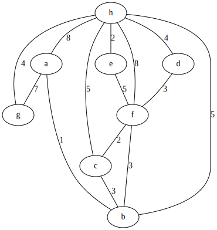
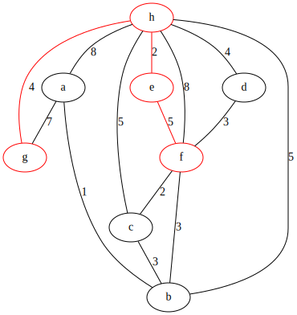
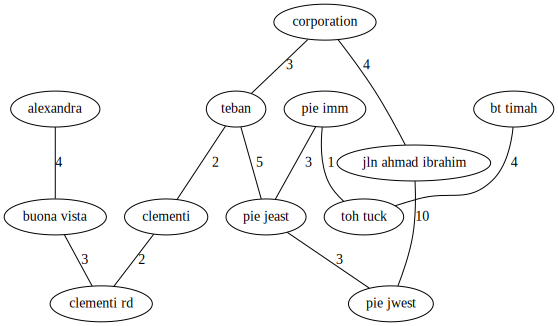
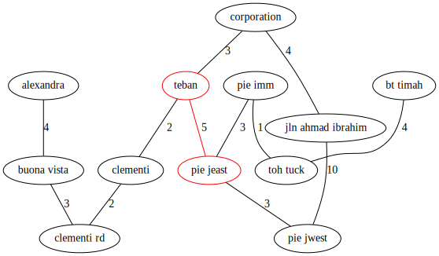

# Visualise shortest path using Dijkstra's algorithm

```python
>>> from dijsktra import Graph
>>> g = Graph.generate_random()
>>> g.view()
```



```python
>>> g.find_shortest_path("g->f")
```



```python
>>> s = """
jln ahmad ibrahim, corporation, 4
corporation, teban, 3
teban, pie jeast, 5
jln ahmad ibrahim, pie jwest, 10
pie jwest, pie jeast, 3
teban, clementi, 2
clementi, clementi rd, 2
clementi rd, buona vista, 3
buona vista, alexandra, 4
pie jeast, pie imm, 3
pie imm, toh tuck, 1
toh tuck, bt timah, 4
"""
>>> g = Graph.from_string(s)
>>> g.view()
```



```python
>>> g.find_shortest_path("teban->pie jeast")
```


